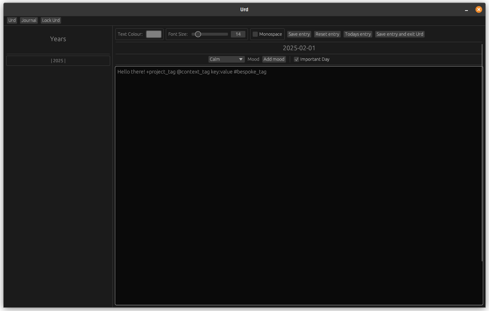
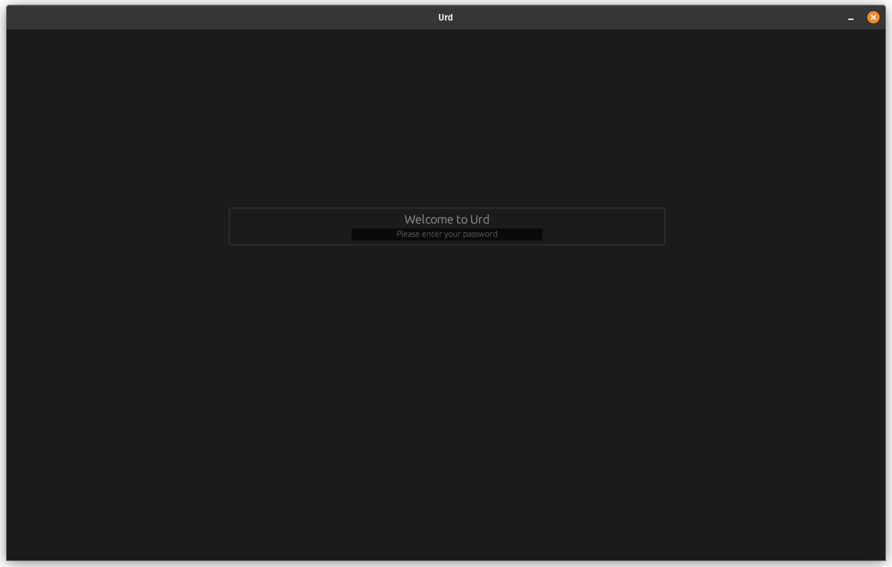

# `Urd`
A journaling app written in rust.

## Name
`Urd` is named after one of the Norns from Norse mythology spinning the threads of fate at the foot of Yggdrasil. `Urd` is responsible for shaping destiny and is responsible for the past.
This association of `Urd` with the past is fitting for a journaling app.

## Features

- Lockable screen
    - Password protection
- If you write a journal entry every day, completed months or years will be marked
    - This can be customised in the `Settings` menu
- Backups
- Export your journal
- Daily mood tracker
    - To add new moods or edit existing moods, use the `Settings` menu
- Important day marker
- Years aspirations
    1. Year Theme
        - Give your year a theme, e.g. `Learning` or `Growth` will be displayed as `Year of Learning` or `Year of Growth`
    2. Year Pledge
        - Give yourself a pledge for the year, e.g. `learn more about Rust` will be displayed as `This year I pledge to learn more about Rust`
    3. Years Resolutions
        - The classic year resolutions
        - As many as you want!
        - No you cannot mark them completed, you won't finish them anyway!
- Guided first start setup
- Tips and Tricks pop up
- Extensive documentation inside the `Help` menu
- Cross-platform
    - Linux (Native)
    - Windows (Tested at each release)
    - macOS (probably, untested because no Apple Silicon)

## Roadmap

*marker* for required features in next release

- [ ] Edit journal page
    - [ ] Deleting a journal entry
    - [ ] Creating a custom journal entry
- [ ] User onboarding
    - [ ] Welcome screen
        - [ ] Add first entry to setup-wizard
        - [ ] Add open help page to setup-wizard
- [ ] Contacts
    - [ ] Name
    - [ ] With text field for free form input? / key value pairs of custom metadata?
    - [ ] Automatic metadata insertion
        - [ ] Upon contact creation and edit
        - [ ] Upon journal entry creation and edit
    - [ ] Display on main screen of contacts in current entry
    - [ ] Contacts in settings / own contacts page
    - [ ] Searchable contacts list
    - [ ] Searchable journal for entries with contacts

## Issues preventing a stable release

- Creating a new viewport will crash the app if it's not supported by the device
    - Should only be an issue if web deployed or on mobile devices
- max tag length is 46 characters, more starts to break the Metadata UI, below the entry text field

## Install
I do not guarantee that any released binary will work on your device.

Binaries (executables) are provided [here](https://github.com/xqhare/urd/releases).

Please note that binaries are only supplied starting with version `0.7`.

Put the executable in any location you like.
`Urd` will generate a directory called `urd_data` in the same directory as the binary.
This directory will store all your data, including your journal entries and settings.

### Linux
Build from source, or download the binary from the latest [release](https://github.com/xqhare/urd/releases). (If I can be arsed to do it)

> [!NOTE]
> Linux binaries are only guaranteed to be compiled at release time.

### Windows
Download the executable from the latest [release](https://github.com/xqhare/urd/releases).

> [!NOTE]
> Windows binaries are only compiled at release time.

> [!IMPORTANT]
> When compiling from source, make sure to use the `--release` flag.
> Without this flag a `cmd` window will be shown whenever `Urd` is run.

### macOS
Build from source.

> [!IMPORTANT]
> While I never tested compiling `Urd` on macOS, there is no reason to assume it wouldn't work.

### Building from source

1. Install Rust
2. Clone this repository
3. Run `cargo build --release` or `cargo build -r`
4. Locate the binary / executable in the `target/release` directory
5. Copy and paste the binary / executable to your desired location

## Password protection

`Urd` supports password protection, which can be used to prevent unauthorized access to the journal.
This protection is not designed to be secure, and should not be used for sensitive data.
It is only intended to protect against a child, spouse or friend from accessing the journal.

There are major issues with password protection:
- Journal data is not encrypted.
- The password is stored as is, only lightly obfuscated, and could be recovered by an attacker.
    - This makes it also possible to retrieve the password should it be lost.

### Help, I forgot the password!

There are two ways to deal with a forgotten password:

#### Removing the password protection
This is the easiest way to deal with a forgotten password.
Please note that this will not only remove the password protection, but reset all settings to their default values.
No Journal data will be lost.

1. You simply delete the `settings.xff` file from the `urd_state` directory in the same directory as the `Urd` executable.
2. Start `Urd`

#### Recovery of the password
This is the only 'non-destructive' way to recover the password. Please read [Removing the password protection](#removing-the-password-protection) first, and use this method only if you are sure about it.

The password is stored inside the `settings.xff` file, located in the `urd_state` directory in the same directory as the `Urd` executable.

1. Open this file in a binary or hex editor. Most editors will display a parsed readout of the file somewhere, and the password should be visible within this readout.
2. Switch to `ASCII` or `utf-8` encoding if needed.
3. Look for the `password` key, and the following clear text value is the password.

Please note that you can not change the password inside the file, as it will break the file.

### Changing the password

You can change the password inside `Urd`, using the `Settings` menu.

## Technical details

### Dependencies

#### `eframe`
The only outside dependency is [`eframe`](https://github.com/emilk/egui).

### All other dependencies
Written by me, you can find them on my [GitHub](https://github.com/xqhare).

